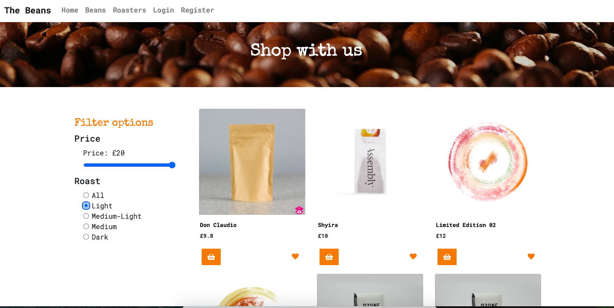

# The Beans, full-stack MERN application - GA Project 3


The Beans is my third project as part of the Software Engineering Immersive course. It is a full-stack MERN application built as part of a group. My class mates for this project were [Natalie Hurst Knight](https://github.com/nhurstknight) and [Lewis Jones](https://github.com/lewisjones0)

The Beans is an e-commerce style application that serves to bring the user a variety of artisinal coffees from roasters around London. The Beans provides each roaster their own page where users can learn more about their brewing process. The Beans also provides sophisticated filtering for users where they can filter by price or blend in order to to refine their search and find the exact coffee for their tastes. Registered users of The Beans may leave comments and ratings on the coffees displayed as well as favourite them to be viewed on their user profile. The Beans features a basket where users may review their order and a checkout section where users may input their preferred payment method. 

The app is currently undergoing a migration from mLabs to Atlas following the discontinued support for the mLab heroku addon. The Beans is available [here](https://thebeans.herokuapp.com/) but will not display full functionality until the migration is complete. 

## Brief & Timeframe:

- Build a fullstack application complete with a backend and frontend of your own creation.
- Use an Express API to serve your data from a Mongo database.
- Consume your API using a frontend built with React.
- Must be a complete product, which contains multiple relationships as well as CRUD functionality.
- Implement thoughtful user stories. 
- Have a visually impressive design.
- Be deployed online so it is publicly accessible.
- Timeframe: 9 days.

## Technologies Used: 

- MongoDB
- Express
- React.js
- Node.js
- JavaScript
- JWT
- Bcrypt
- Axios
- Git & GitHub
- React-Bootstrap
- Faker
- Mongoose
- Mongoose-unique-validator
- Nodemon
- React-toastify
- Fort Awesome
- Node-Sass
- React-router-dom

## Starting Off: 

1. Access the source code via the 'Clone or download' button
2. In CLI, run npm and then npm i on the root level to install dependencies for the backend
3. In CLI, open a new tab, and navigate to frontend cd frontend and run the same commands npm and npm i to install dependencies
4. Run command npm start in both tabs to run program in your local environment

## Demonstration of the App Flow:

**Note: As the app is currently in the process of a database transfer, some of the pages of the app cannot be displayed properly. The Beans show page, roaster show page and pages associated with authentication cannot be displayed until the migration is complete.**

### The landing page, where the user can navigate to the beans show page or to login/register.


### The beans index page, where users can browse the coffee selection. 



### The beans show page, where users can select the quantity they would like to purchase as well as leave comments & ratings.
-

### The roaster show page, where users can browse the various roasters whose product is available for purchase. 


### Login and Register pages.


### User profile page, where user favourites are displayed.
-
### Basket, where selected coffees are kept prior to checking out.
-
### Checkout page.
-
### Address and payment pages.
-

## Functionality

The Beans features functionality similar to other e-commerce websites. Users can:

- Register & Login
- Browse the selection of coffees.
- Read more about the roasters of those coffees.
- Comment, rate and favourite coffees.
- Purchase products.
- Filter through products for their specific tastes.

## Process

Once my class mates and I had received the project brief, we brainstormed various ideas for an app that we all would personally use. I suggested the idea of a coffee based app where users could learn about coffees and my colleague Natalie suggested users could buy them too. With this idea in mind we took to trelloboard to begin planning the development of our application. We knew from the start that we wanted to produce our own RESTful API, so following the initial planning stage where our trelloboard was set up and hand-drawn wireframes were produced, we dedicated a full day toward gathering coffee and roaster data to fill our API. 


Once we were satisfied with our planning and had our data ready, we began working on the backend as a group. We would code seperately later. In our backend, we created models, controllers and routes for the beans index, show, roaster show and e-commerce aspects of the app. Lewis and I had worked on a seeds file at this point too, utilising the data the three of us had gathered the day before. 

With the backend ready by day 3, each of us now seperated to complete our assigned responsibilities for the frontend of the app.

## Division of Labour

The Beans was the most complex application any of us had made on the course so far, as such, we decided utilising the trelloboard was the most effective way of dividing the work. We kept a list of tasks on the trelloboard that needed doing in the 'to do' section, each of us would select a task and move it into a 'doing' section of the board. Once complete, it would be moved to the 'done' section and we would choose a new aspect of the app to work on. This way all of us could keep track of where each of us was upto in the development process, and if a group member was on a particular section for longer than expected, we would convene as a group in order to troubleshoot any issues together before moving on. 

My responsibilities for the frontend of the app included the comments section on the beans show page and the React-toastify popups. 

## Featured Piece of Code

The Comment Component served as a funtional component where users can write a comment within a textbox, as well as leave a rating for the coffee they are currently viewing. Notice the handleChange and handleSubmit props. 

```JavaScript
import React from 'react'

import { Form, Button } from 'react-bootstrap'

const CommentComponent = ({ handleSubmit, handleChange, value }) => {
  return (
    <Form onSubmit={handleSubmit}>
      <Form.Group controlId="text-comment-form">
        <Form.Label className="review-labels">Please leave your comment</Form.Label>
        <Form.Control
          as="textarea"
          rows="3"
          type="text"
          onChange={handleChange}
          name="text"
          value={value.text}
        />
      </Form.Group>
      <Form.Group controlId="rating-radio-btn">
        <Form.Label className="review-labels">Please leave a rating from 1-5</Form.Label>
        {['radio'].map((type) => (
          <div key={`inline-${type}`} className="mb-3">
            <Form.Check inline label="1" value="1" name="rating" type={type} id={`inline-${type}-1`} onChange={handleChange}/>
            <Form.Check inline label="2" value="2" name="rating" type={type} id={`inline-${type}-2`} onChange={handleChange}/>
            <Form.Check inline label="3" value="3" name="rating" type={type} id={`inline-${type}-2`} onChange={handleChange}/>
            <Form.Check inline label="4" value="4" name="rating" type={type} id={`inline-${type}-2`} onChange={handleChange}/>
            <Form.Check inline label="5" value="5" name="rating" type={type} id={`inline-${type}-2`} onChange={handleChange}/>
          </div>
        ))}
      </Form.Group>
      <Button variant= "primary" type="submit" value="Submit">Submit</Button>
    </Form>
  )
}

export default CommentComponent
```

The Comment Card displays user the posted comment on the coffee. Seperate from the comment component, it shows the username, comment and rating that the user left on the coffee currently being viewed.

```JavaScript
import React from 'react'
import { Card } from 'react-bootstrap'

const CommentCard = ({ text, rating, owner }) => {
  return (
    <Card className='comment-view-card'>
      <Card.Body>
        <Card.Title> { owner.username }: </Card.Title>
        <br />
        <Card.Subtitle> { text } </Card.Subtitle>
        <br />
        <p> {`${rating}/5 ⭐️`} </p>
      </Card.Body>
    </Card>
  )
}

export default CommentCard
```

The following code snippet shows how the Comment Card and Comment Component were integrated into the larger beans show page, with bootstrap styling. 

```JavaScript
        <Container className="comments">
          <Container className="comment-submit-container">
            <h2>Leave a Comment</h2>
            <CommentComponent 
              value={this.state.formData}
              handleChange={this.handleChange}
              handleSubmit={this.handleSubmit}
            />
          </Container>

          <Container className="comment-view-container">
            <h2>Customer Reviews</h2>
            {this.state.productData.comments.map(comment => (
              <CommentCard className="comment" key={ comment._id }{ ...comment }/>
            ))} 
          </Container>
        </Container>
```

These final snippets highlight how I added some polish to the app by having little toast popups appear in sensible places throughout the app. Notice how the toast will activate upon completion of the asynchronous event of a comment being left on a specific bean. 

```JavaScript
import { toast } from 'react-toastify'
import 'react-toastify/dist/ReactToastify.css'

toast.configure()

  handleSubmit = async event => {
    event.preventDefault()
    const beansId = this.props.match.params.id
    const response = await addCommentToBean(beansId, this.state.formData)
    console.log(response)
    const formData = {
      text: '',
      rating: '⭐️'
    }
    this.getData()
    this.setState({ formData })
    toast.success('Thank you for leaving a review!', { position: toast.POSITION.BOTTOM_CENTER })
  }
```

## Styling

We wanted The Beans to have a charming and inviting style, where bright orange was the highlight colour of the app, contrasted by simple black and white, and accented with charming icons and buttons. Thus, we decided to learn and utilise React-bootstrap for its wide variety of stylistic options as well as React-toastify and Fort Awesome for polish in icons and popup notifications. Hours were spent reading through the documentation which we believe all payed off as the app boasts a very modern design. 

## Bugs

As the app is currently undergoing a database migration, the following bugs will be found when visiting The Beans:

- Beans index not displaying.
- Roaster page not displaying.
- Cannot register a new user.
- Cannot log in.
- Cannot view the pages associated with authentication, primarily the e-commerce pages.

## Challenges

- Working through merge conflicts and generally working with Git in the creation of branches that need to be merged and pushed out to the team members proved to be fairly tricky at the start. But with time this became more and more managable.

- Disagreements with team members over the direction or specific styling of the app created moments of frustration, this was resolved quickly however due to a shared desire for the app to be the best that it can be given the time we had. 

- A personal challenge of mine is remembering to test code as I write it, as I had several issues in the functionality of my code that were quickly resolved with a simple console log to see what the issue was exactly, which would have saved me time in the long run.

## Wins

- Seeing the final product come together and function properly is immensively satisfying and why I love to code in the first place.

- Working in a group presented the opportunity to bounce ideas off other developers of a similar skill level to my own and created an environment of support and learning which is very rewarding to be a part of.

- Seeing individual components I create fit into the puzzle of the larger app and work in unison with the components my team mates produce is hugely gratifying and I do look forward to working in a group again in the future. 

## Future Features 

- Refinement of the current features, the payment page was not entirely finished before we ran out of time and revisiting that to perfect it is a desire of mine.

- Comments that users have left on coffee will be displayed in their profile page.

## Key Learnings

When working in a group, keeping up with your team mates both in development and in communication is vital for the success of your app, and with the team mates I had I believe each of us did very well in this regard. The value of good planning and executing on that planning in a timely manner was reinforced for all group members during this project. Also, the ability to accept that some features will not manifest the way we originally envisioned them due to time or technical restraints, but understanding that it is okay and there will be time in the future to work on those aspects of the app, and moving onto goals which can be more readily accomplished is highly important in a group setting. 